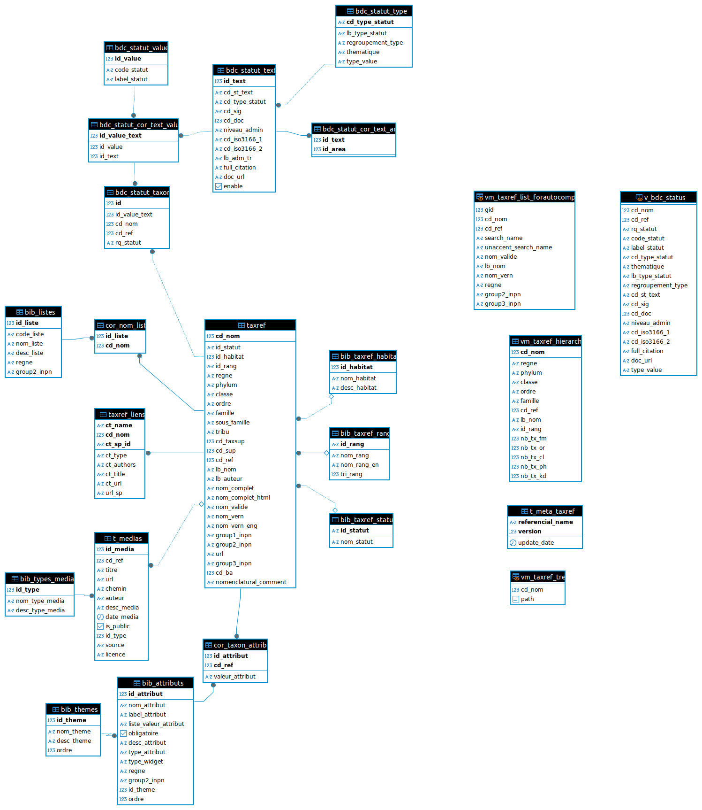

# TaxHub

Application web de gestion centralisée des taxons basée sur le
référentiel TAXREF
(<http://inpn.mnhn.fr/programme/referentiel-taxonomique-taxref>) du
SINP.

Elle permet de gérer la liste des taxons présents dans chaque structure,
d'y greffer des informations spécifiques, de définir des listes de
taxons et des filtres en fonction des besoins.

Elle est utilisée pour la structuration des taxons dans GeoNature
(<https://github.com/PnX-SI/GeoNature>) à partir de sa version 1.4.0.

Elle permet aussi de gérer les descriptions et les médias des taxons
pour leur affichage dans GeoNature-atlas (ou autre).

Elle peut être installée en tant qu'application autonome, ou intégrée dans GeoNature.

# Documentation

La documentation d'installation de TaxHub est disponible sur https://taxhub.readthedocs.io.

TaxHub peut aussi être installé à partir du script d'installation
globale de GeoNature : <http://docs.geonature.fr/installation-all.html>.

# Principes

Voici le modèle conceptuel de la base de données de TaxHub (schéma `taxonomie`) :

Une partie correspond au TAXREF complet et à la base de connaissance « Statuts » 
tels que fournis par le SINP. Son contenu ne doit pas être modifié.
 
On peut ensuite associer des informations spécifiques grâce à
`bib_attributs` (patrimonialité, marqueurs, autres selon les besoins), 
ajouter des médias aux taxons (`t_medias`) et
définir des listes de taxons (espèces d'un protocole, ...) dans
`bib_listes` en fonction des besoins.

## Technologies

-   Langages : Python, HTML, JS, CSS
-   BDD : PostgreSQL, PostGIS
-   Serveur : Debian ou Ubuntu
-   Framework python : Flask, Flask-admin
-   Framework CSS : Bootstrap

## Gestion des permissions

Elle est centralisée dans l'application
[UsersHub](https://github.com/PnX-SI/UsersHub). Il faut donc disposer de
l'application `TaxHub` dans UsersHub et y intégrer des groupes et/ou
utilisateurs.

Niveaux de permissions (si TaxHub est installé en application autonome) :

-   2 = Gestion des taxons (ajout/modification/suppression des
    attributs, liste et médias sur les taxons)
-   6 = Administrateurs : création de listes, attributs et thêmes

Si TaxHub est intégré à GeoNature, alors on utilise le mécanisme de permissions de GeoNature, 
en définissant aux utilisateurs et groupes d'utilisateurs, les actions qu'ils peuvent faire 
sur chaque objet de TaxHub (taxons, listes, attributs, médias...).

## Licence

-   OpenSource - GPL V3
-   Copyright (c) 2014-2024 - Parc National des Écrins - Parc national
    des Cévennes

