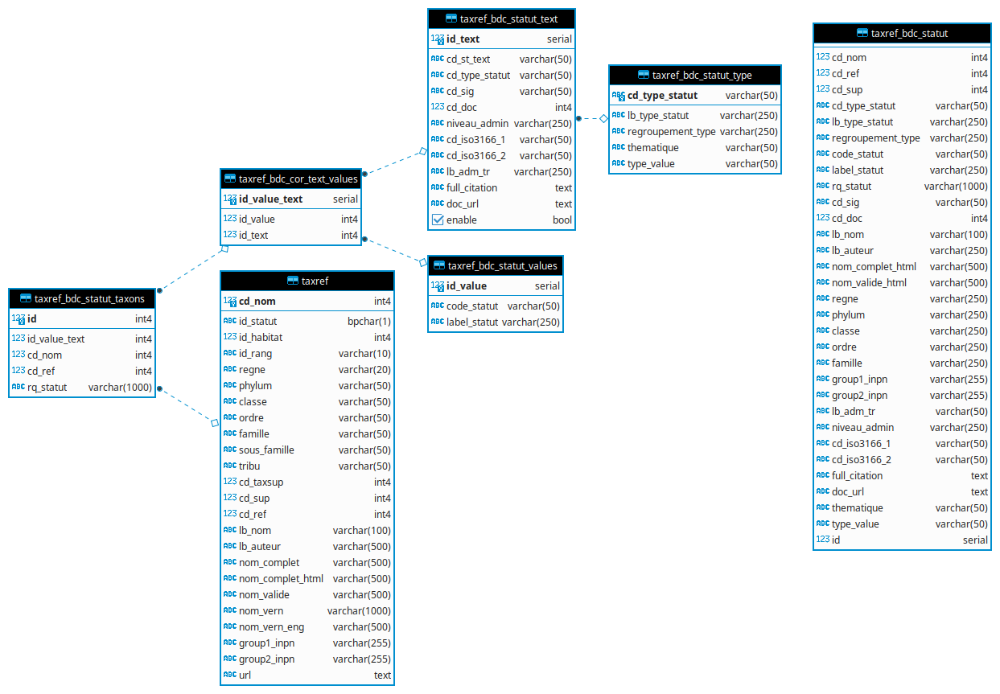
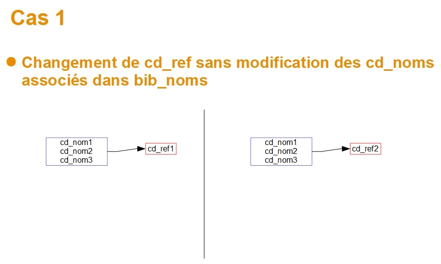
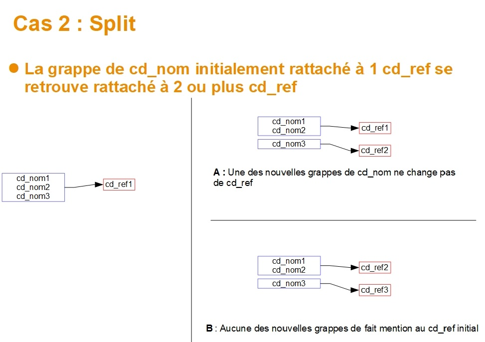
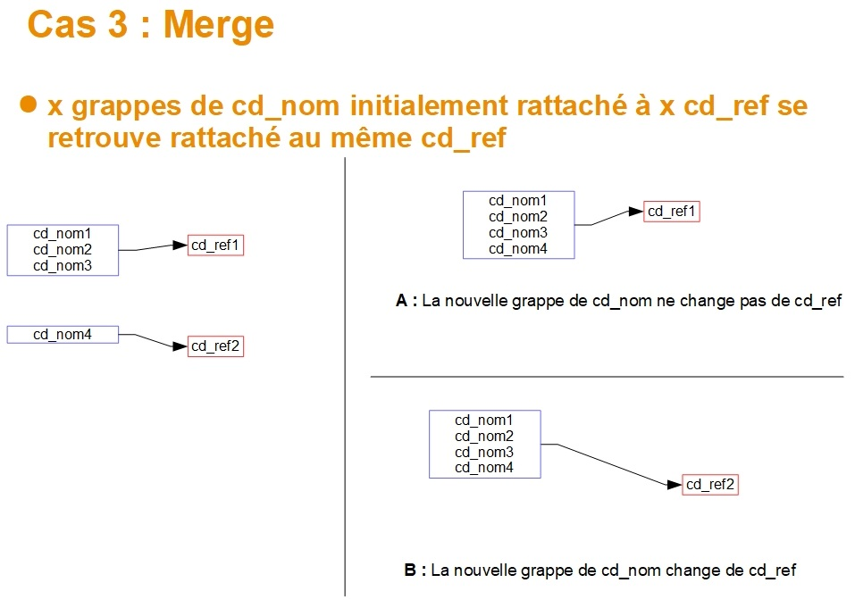
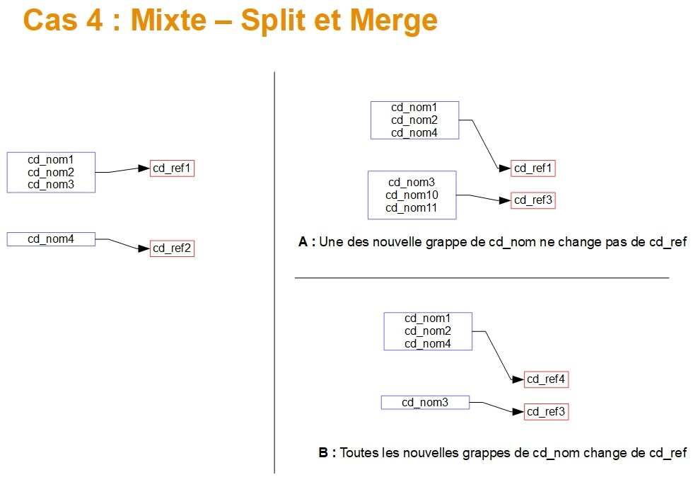

Update Taxref
==============

Scripts de migration permettant de mettre à jour une version de Taxref à une autre.

Avant de commencer :

* La migration d'une version de Taxref est une opération conséquente. Ce script permet d'automatiser au maximum les opérations, mais certaines parties reviennent à l'administrateur de données et il est important de comprendre les différentes étapes.
* Il est important aussi de faire une sauvegarde avant de réaliser ces opérations et de faire des tests et vérifications des données au fur et à mesure et à la fin des opérations.
* Une partie des scripts est réalisée avec l'utilisateur propriétaire de la BDD (``$user_pg``) défini dans le fichier ``settings.ini``. Une autre est réalisée avec le super-utilisateur ``postgres`` pour pouvoir réaliser les taches de copie notamment. Ainsi les scripts ne fonctionnent que si la BDD est sur le même serveur que celui où sont exécutés les scripts (``$db_host = localhost``).

Le passage vers une nouvelle version de Taxref se fait en 3 étapes, disponibles sous forme de scripts ``.sh`` dans le répertoire  ``data/scripts/update_taxref/`` :

**1. import_taxref_vXX_data.sh** : import de Taxref et détection des changements de ``bib_noms``.

Un export des changements est réalisé à l'issue du script, dans le fichier ``/tmp/liste_changements.csv``.

* Télécharge la version de Taxref et import dans les tables ``taxonomie.import_taxref``, ``taxonomie.cdnom_disparu`` et ``taxonomie.taxref_changes``
* Analyse des données dans la Synthèse de GeoNature et identification de celles dont le cd_nom a disparu dans la nouvelle version de Taxref (listés dans le fichier ``/tmp/liste_cd_nom_disparus_synthese.csv``)
* Insertion des cd_noms de remplacement de ceux ayant disparus dans ``bib_noms``, si non déjà présents
* Identification des cd_noms ayant disparu dans la table ``taxonomie.bib_noms``
* Liste des cd_nom supprimés de ``taxonomie.bib_noms`` dans le fichier ``/tmp/liste_cd_nom_disparus_bib_noms.csv``
* Détection et export des changements à venir dans le schéma temporaire ``tmp_taxref_changes`` et sa table ``comp_grap``
* Liste dans le fichier ``/tmp/liste_changements.csv`` les changements qui vont être réalisés (et leur nombre dans le fichier ``/tmp/nb_changements.csv``) et les potentiels conflits qu'il faut résoudre en amont

Pour exécuter ce script, placez-vous dans ``/home/myuser/taxhub/data/scripts/update_taxref``, renseignez le mot de passe sudo avec la commande ``sudo ls`` puis lancer le script avec la commande ``./import_taxref_v13_data.sh``.

Analysez les logs (dans ``taxhub/var/log/updatetaxrefv13/``) ainsi que les fichiers CSV générés dans le dossier ``/tmp``. Réalisez les corrections de données en fonction :

- Répercuter les conséquences des cd_noms disparus sur les données de GeoNature (Synthèse, Occtax et éventuelles autres sources). Ceux de la table ``taxonomie.taxref_protection_especes`` sont optionnels.
- Gérer les attributs en conflit (cd_nom mergés et attributs incohérents)
- Gérer les éventuels splits
- Vérifier les éventuels taxons locaux (Hors Taxref) si ils ont été ajoutés dans la nouvelle version de Taxref

Toutes ces opérations peuvent être regroupés dans un fichier SQL exécuté dans le script suivant.

**2. apply_changes.sh 14** : Application des modifications dues au changement de Taxref.

Le script ne peut s'exécuter entièrement que s'il n'y a plus de conflits. Le script vous indiquera les éventuelles corrections restant à faire. Les différents fichiers CSV du dossier ``/tmp`` seront mis à jour par ce script, ainsi qu'un fichier complémentaire ``liste_donnees_cd_nom_manquant.csv``. Lancer le script avec la commande ``./apply_changes.sh 13``.

Il peut aussi être nécessaire de désactiver des contraintes d'intégrité vers ``taxonomie.taxref.cd_nom``.

Il est possible de scripter la résolution de conflits en créant les fichiers SQL suivants à partir des exemples (``.sample``) :

* ``2.1_taxref_changes_corrections_pre_detections.sql`` (pour les corrections des données d'observation ainsi que les éventuelles désactivations de contraintes vers le champs ``taxonomie.taxref.cd_nom``)
* ``2.2_taxref_changes_corrections_post_detections.sql`` (utile surtout dans le cas de splits, permet notamment de changer la colonne ``action`` de la table ``tmp_taxref_changes.comp_grap`` et d'indiquer si on veut dupliquer les médias et attributs)
* ``4.3_restore_local_constraints.sql`` permettant de restaurer des contraintes après intégration de la nouvelle version de Taxref et mise à jour des données + Mise à jour éventuelle de la version de Taxref dans les paramètres de GeoNature + Ajout des taxons locaux dans ``bib_noms``, ``cor_nom_liste`` et leurs éventuels attributs et médias

Après correction des données d'observation (Occtax, Synthèse...), vous pourrez relancer le script.

* Le script liste dans la table ``tmp_taxref_changes.dps_fk_cd_nom`` toutes les tables de la BDD contenant des cd_noms ayant disparus, ainsi que les cd_nom concernés (en s'appuyant sur les clés étrangères connectées au champs ``taxref.cd_nom``). Le résultat est exporté dans le fichier ``/tmp/liste_donnees_cd_nom_manquant.csv``
* Adaptation de la structure de la table ``taxonomie.taxref``
* Mise à jour du contenu de la table ``taxonomie.taxref`` à partir de la table ``taxonomie.import_taxref`` (update champs, ajout nouveaux noms et suppression des noms disparus)
* Répercussion dans la table ``taxonomie.cor_nom_liste`` des cd_noms remplacés et supprimés
* Mise à jour des cd_ref de ``taxonomie.bib_noms`` en fonction des cd_noms, suppression des noms disparus, ajout des noms de références manquants
* Répercussion des évolutions de Taxref sur les tables ``taxonomie.t_medias`` et ``taxonomie.cor_taxon_attribut`` en fonction des cas et actions définis dans la table ``tmp_taxref_changes.comp_grap``
* Import de la BDC statuts de l'INPN v14
* Traitement de la BDC statuts et structuration

**3. clean_db.sh** : Suppression des tables résiduelles

Les logs de ces scripts sont disponibles dans le répertoire ``montaxhub/var/log/updatetaxrefvv14``.

